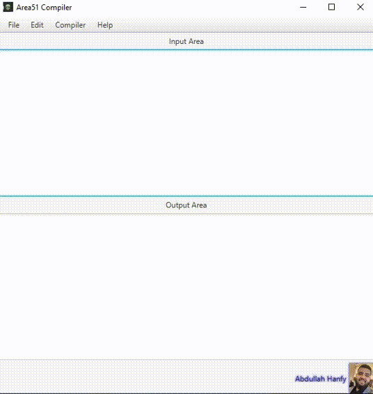

# Compiler_JavaFX
I had made a simple compiler for ( C and Java) with JavaFx. 

## This is The Demp of Project 

## Project Description :- 
In this project I had made a simple notepad with its functionalities:-
- open new files
- save your note
- Edit menu with all functions of text.
Also The program has a new feture that you can Compile and run Java for C program.

## Tools:-
I had used JavaFX with its functionalities to build my project.
